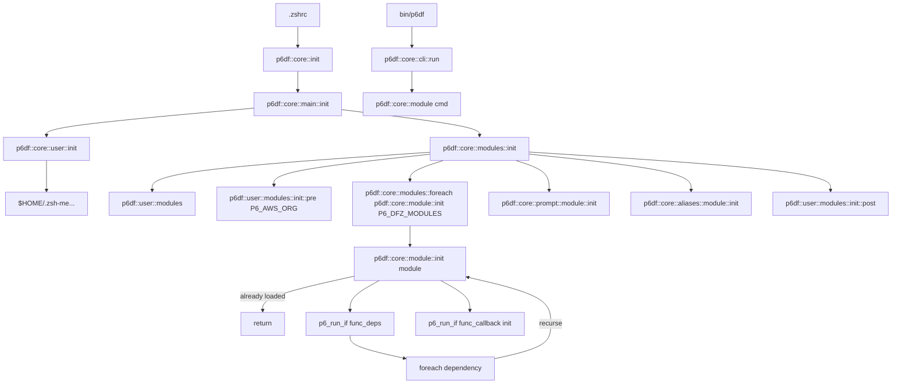

# p6df Initialization and CLI Flow

This document describes the initialization sequence of `p6df` as executed from `.zshrc`, including module dependency recursion, callbacks, and the CLI execution path.

---

## High-Level Entry Points

- Shell initialization: `.zshrc`
- CLI entry point: `bin/p6df`

---

## Initialization Flow (`.zshrc`)

```text
.zshrc
└─ p6df::core::init
   └─ p6df::core::main::init
      ├─ p6df::core::user::init
      │    └─ loads "$HOME/.zsh-me..."
      │
      ├─ p6df::core::modules::init
      │   ├─ p6df::user::modules
      │   ├─ p6df::user::modules::init::pre $P6_AWS_ORG
      │   ├─ p6df::core::modules::foreach "p6df::core::module::init" $P6_DFZ_MODULES
      │   │   └─ p6df::core::module::init "$module"
      │   │       ├─ return if already loaded
      │   │       ├─ p6_run_if "$func_deps"
      │   │       │   └─ foreach dependency
      │   │       │       └─ recurse (tail-recursive)
      │   │       └─ p6_run_if "$func_callback"  # init
      │   │
      │   ├─ p6df::core::prompt::module::init
      │   ├─ p6df::core::aliases::module::init
      │   └─ p6df::user::modules::init::post
```

```text
bin/p6df
└─ p6df::core::cli::run
   └─ p6df::core::module::$cmd
```

